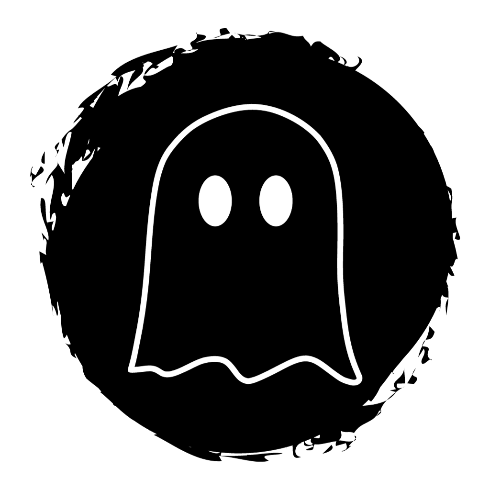

<div align="center">
    
    <h1>getjumpscared</h1>
    <p>A Powershell script which will trigger a jumpscare</p>
</div>

## About   

I'm not sure if this works on Linux or Mac, because I designed it for Windows. 

The jumpscare was written in Python.  

By default this script downloads a jumpscare inspired by Five Nights at Freddy's from this repository.

## Dependencies

- Python  

- The following libraries, which will be automatically installed:  

```bat
pip install opencv-python
pip install pygame
pip install pycaw
pip install comtypes
```

## How to use it

Just run the Powershell script.  

Please note that you'll need non-restricted internet access for it to work.  

You can also change the jumpscare video and audio links if you like.

### Run it with one line of code

To download it from this repository and run it at the same time, run this command in Powershell:
```powershell
irm raw.githubusercontent.com/Nitro4542/getjumpscared/main/scripts/downloader.ps1 | iex
```

## How does it work?

Here is everything the script does:  

- Check if Python is installed  
- If Python is installed, install opencv-python, pygame, pycaw and comtypes using pip  
- Create a folder called "jumpscare" inside %temp% if it doesn't exist  
- Copy the python script to jumpscare.py inside %temp%\jumpscare  
- Download an MP4 file for the jumpscare from this repository (if it doesn't exist in the temp folder)  
- Download an MP3 file for the jumpscare from this repository (if it doesn't exist in the temp folder)  
- Run the jumpscare.py script  

## How to make it seem more legit

Feel free to change anything you might think could look suspicious.  

## How to Contribute

You can help by fixing some bugs, create issues or create pull requests.  

All though this is a project I made in 2 hours, help is highly appreciated!

## Disclaimer

I am not responsible for any damage you do with this script.
